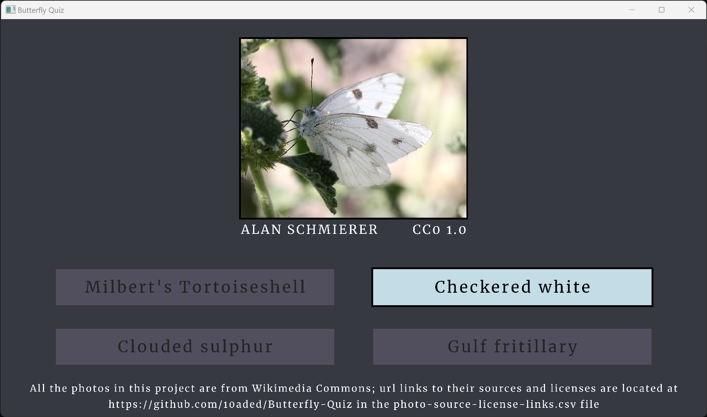

# Butterfly Quiz

This is a simple quiz game / app to help the player learn common butterflies native to North America, written from scratch in Zig/raylib.

## Build Instructions

This is a Zig project, that natively calls raylib code written in C. (More on dependencies below.)

Since the Zig compiler comes with its own build system, the project can be built and run with the command

`zig build run`

(when called from within the top directory of the project). A release build can be created with `zig build -Doptimize=ReleaseFast`.

The project was built with the Zig 0.11.0 compiler, available from the [download page](https://ziglang.org/download/) on `ziglang.org`.

## Photo Information

All photos in this project are from [Wikimedia Commons](https://commons.wikimedia.org/wiki/Main_Page). As such, they have all been released under various Creative Commons / Public Domain licenses. Links to the sources of these photos, their authors, and to the exact licenses of the photos can be found in the [photo-source-license-links.csv](photo-source-license-links.csv) file. We recommend using *Modern CSV* ([webpage](https://www.moderncsv.com/)) to view the `.csv` file.

The list of butterflies was taken from the book *Familiar Butterflies of North America* (National Audubon Society, 1990, Knopf, ISBN: `978-0-679-72981-5`). By default, the order of butterflies that appear in the quiz are randomized, but if they were to appear sequentially (as in the `.csv` file), they would appear in the same order as the do in the book.

## Dependencies

The project is written in Zig using the raylib library. We included the necessary source files from this in our project under the raylib directory, but deleted unnecessary parts of it (like its numerous examples). The files from it than are included are from commit number 710e81.

Raylib is created by Ramon Santamaria (GitHub handle [@raysan5](https://github.com/raysan5)) and is available on GitHub [here](https://github.com/raysan5/raylib). See the link above for Raylib's full license / copywrite details.

## Development

The entire development of this app (basically) was streamed on Twitch and recordings were uploaded to YouTube at:

https://www.twitch.tv/10aded

https://www.youtube.com/@10aded
